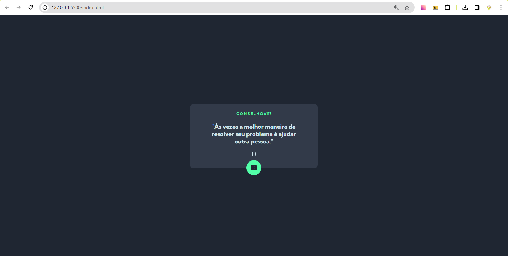

# Frontend Mentor - Advice generator app challenge

## Welcome!

This is a solution to the [Advice generator app challenge on Frontend Mentor](https://www.frontendmentor.io/challenges/advice-generator-app-QdUG-13db). Frontend Mentor challenges help you improve your coding skills by building realistic projects. 

## The challenge

My task was to replicate the Advice generator app to closely resemble the provided design.

## Implementation

I utilized HTML and CSS to recreate the Advice generator app, breaking down the challenge into manageable parts to achieve the desired outcome.

## Technologies Used

- Semantic HTML5;
- CSS custom properties;
- Flexbox;

### The result of challenge

### Link

- Solution URL: 
